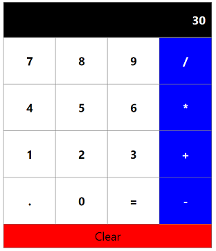

# Calculator
 
The calculator is a fairly straightforward program using HTML, CSS, and Javascript. The calculator screen is basically an array of HTML buttons, styled with CSS. The buttons stand for numbers and operators, and the result display. There is an equal button, a decimal point button, and an all-clear button as well.

The Javascript takes a number from the user, then an operator, then another number, and displays the result, in the same order as a normal calculator. There can be multiple inputs and multiple operations, each perform in the input order. The data is processed like a calculator and not an adding machine.

# Update

So, I wanted to refactor this using React and Flexbox. After some tinkering with the program, I realized that this required an entire overhaul of the code I had written. I decided that the easiest solution would be to start from scratch and create a new Calculator. The resulting program is actually much simpler than the original - I was even able to handle the operations with MathJS. It's amazing how cleaner and more streamlined React is compared to vanilla JS! 

